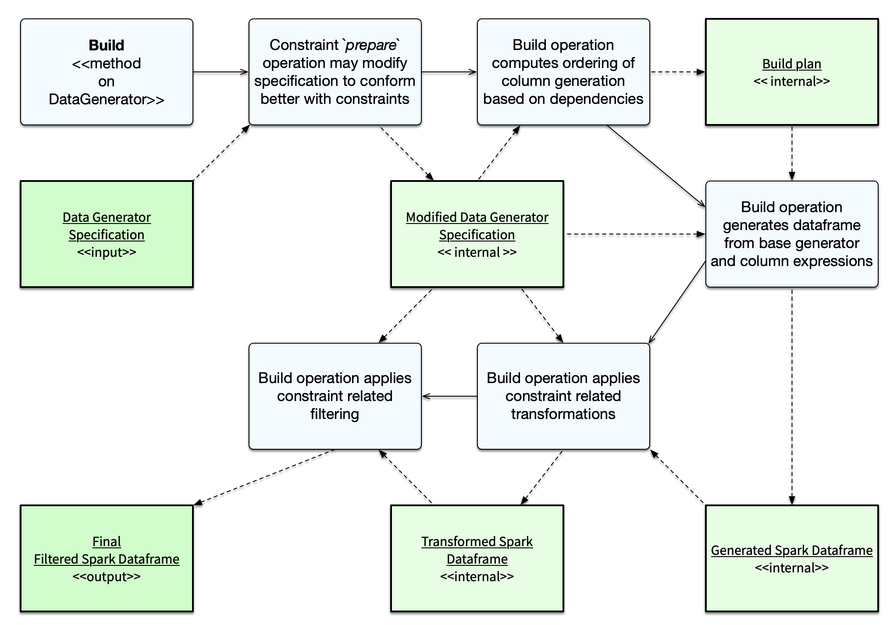

.. Databricks Labs Data Generator documentation master file, created by
   sphinx-quickstart on Sun Jun 21 10:54:30 2020.

Using Constraints to control data generation
============================================

You can use the `constraints` subpackage to limit the data generated to only data that satisfies specific conditions.

While similar effects can be achieved by applying `where` clauses to the generated dataframe, the Constraints objects
may use a variety of effects to satisfy the constraint, including filtering, modifying the data generation strategy
or transforming the generated data.

Any statistical distribution applied to the data generation through the use of objects in the `distributions`
subpackage, or implicitly through the use of weights or other means, are only applied **before** the application
of constraints.

.. note ::
   When using constraints, the `number of rows` parameter applied to the data generation specification
   determines the number of rows generated **before** constraints are applied.

   Due to the possible filtering effects of constraints, the number of rows actually produced may be less, or even zero
   if there are no rows that satisfy the constraints.

How constraints are implemented
-------------------------------

Constraints are implemented in the following ways:

- The data generation specification may be modified to generate data that conforms more closely with the constraints
   - This may modify the internal column definitions
- The Spark data frame columns may be transformed to conform with constraints
   - This may impact conformance with statistical distributions
- The Spark data frame may be filtered (using `where` clauses) to conform with the constraints
   - This may reduce the final row count from the requested row count (or even completely filter all data)

Generally speaking, the SQL expression constraints will be implemented purely using filtering whereas other
constraints may use modification of the data generation spec and / or transformation.

.. note:: These modifications will be performed in-place on the the data generation specification. If the same
          data generation specification is being used to generate multiple data sets but with different constraints,
          it should be cloned before applying constraints.

The full documentation for the constraints can be found in the API documentation for the `constraints` subpackage.

Example
-------
We'll use a simplified customer purchase order to show constraints.

For this dataset, customers with randomly generated names and email addresses will have orders represented by a
product_sku code, an order_ts timestamp and a shipping_ts which may be null.

While the example is somewhat contrived, as you could achieve resulting dataset more efficiently by computing
a random shipping delay, we can use a constraint to discard any rows where the shipping timestamp is earlier than the
order timestamp.

.. code-block:: python

   import dbldatagen as dg

   data_rows = 10000000

   dataspec = dg.DataGenerator(spark, rows=10000000, partitions=8)

   dataspec = (
       dataspec.withColumn("name", "string", template=r"\\w \\w|\\w a. \\w")
       .withColumn(
           "product_sku", "string", minValue=1000000, maxValue=1000000 + 1000, prefix="dr", random=True
       )
       .withColumn("email", "string", template=r"\\w.\\w@\\w.com")
       .withColumn("qty_ordered", "int", minValue=1, maxValue=10, distribution="normal", random=True)
       .withColumn("unit_price", "float", minValue=1.0, maxValue=30.0, step=0.01, distribution="normal",
                   baseColumn="product_sku", baseColumnType="hash")
       .withColumn("order_ts", "timestamp", begin="2020-01-01 01:00:00",
                   end="2020-12-31 23:59:00",
                   interval="1 minute", random=True )
       .withColumn("shipping_ts", "timestamp", begin="2020-01-05 01:00:00",
                   end="2020-12-31 23:59:00",
                   interval="1 minute", random=True, percentNulls=0.1)
       .withSqlConstraint(""shipping_ts is null or shipping_ts > order_ts"")
   )
   df1 = dataspec.build()

